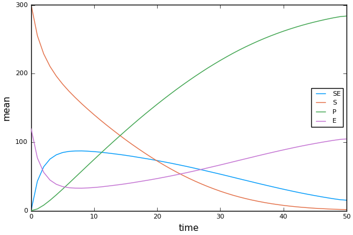
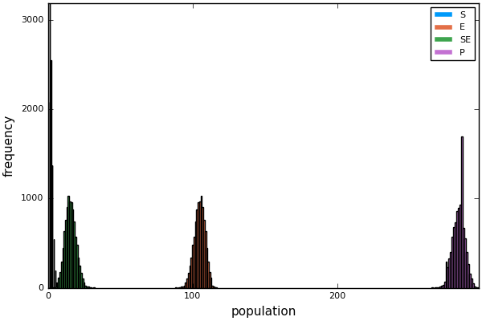
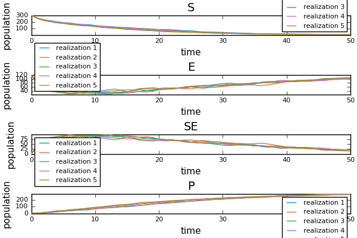

BioSimulator.jl
===============

BioSimulator is a stochastic simulation package for biochemical reaction networks.

## How To Use

To illustrate a typical workflow in BioSimulator, we will implement a simple birth-death-immigration process (Kendall's Process).

First, we load BioSimulator and create an empty `Network`:

```jl
>julia using BioSimulator
>julia m = Network("Kendall's Process")

[ Model: Kendall's Process ]
 no. species:    0
 no. reactions:  0
```

The `Network` type is built on `Species` and `Reaction`s. The `Species` type is used to describe distinct populations in the network (e.g. a molecule). For this example, we will define one `Species` named `X` with initial population `5`:

```jl
julia> m <= Species("X", 5)
Dict{Symbol,BioSimulator.Species} with 1 entry:
  :X => 5…
```

Next, we define the three reactions that occur in our network - birth, death, and immigration - using the `Reaction` type:

```jl
julia> m <= Reaction(:Birth, :α, :(X --> X + X))
julia> m <= Reaction(:Death, :μ, :(X --> 0))
julia> m <= Reaction(:Immmigration, :ν, :(0 --> X))
Dict{Symbol,BioSimulator.Reaction} with 3 entries:
  :Death        => X --> ∅
  :Immmigration => ∅ --> X
  :Birth        => X --> 2 X
```

The first argument to the constructor is an identifier for a reaction. The second argument assigns a *stochastic* rate constant. The last argument is a `Expr` object that resembles a chemical formula. It is constructed by entering a colon (:) and enclosing the formula with parentheses. Reactants appear on the left, while products appear on the right. A `0` is used to denote the absence of a reactant or product. Additionally, one may specify stoichiometric coefficients e.g. `:(X --> 2*X)` or `:(X --> 2X)`.

Finally, we can simulate the model using a stochastic simulation algorithm. This example invokes Gillespie's Direct Method (SSA):

```jl
julia> result = simulate(m, SSA(4.0), sampling_interval=0.1, nrlz=100_000)
```

The `simulate` method accepts a `Network` model followed by an `Algorithm`. The optional argument `nrlz` is used to specify the number of individual simulations generated by a single simulation job. The other argument `sampling_interval` indicates that output should be recorded every 0.1 units of time on the interval [0.0, 4.0]

The algorithm `SSA` accepts a single argument used to denote the end time for the simulation. Other algorithms require additional simulation parameters.

The output returned is a `PartialHistory` of the simulation data. It stores records of each species population throughout the simulation job recorded at specific intervals. Additionally, a `Dict` stores algorithm statistics and other simulation metadata of interest.

`BioSimulator` provides a few convenient methods to visualize simulation data using the `Plots` package:

```jl
julia> plot(MeanTrajectory([:S, :E, :SE, :P]), result)
```



```jl
julia> plot(Histogram([:S, :E, :SE, :P], 4.0), result)
```



```jl
julia> plot(SampleTrajectory([:S, :E, :SE, :P], 5), result)
```



One may even animate the population distribution through time:

```jl
julia> anim = @animate for t in result.t
  plot(Histogram[:P], t), result)
  end
julia> gif("/some/file/path/file.gif", anim, fps=5)
```


## Supported Algorithms

### Exact Algorithms
* SSA - Stochastic Simulation Algorithm (Gillespie Algorithm/Direct Method)
* ODM - Optimized Direct Method
* NRM - Next-Reaction Method
* FRM - First Reaction Method

### Approximate Algorithms
* SAL - Step Anticipation τ-leaping
