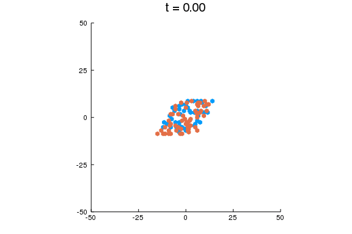

````julia
using InteractiveUtils
using NewBioSimulator
using Plots
# force the GR backend to use crisp SVG output
# gr(fmt = :svg)
````


````
Julia Version 1.1.0
Commit 80516ca202 (2019-01-21 21:24 UTC)
Platform Info:
  OS: macOS (x86_64-apple-darwin18.2.0)
  CPU: Intel(R) Core(TM) i7-4750HQ CPU @ 2.00GHz
  WORD_SIZE: 64
  LIBM: libopenlibm
  LLVM: libLLVM-6.0.1 (ORCJIT, haswell)
````


## Foxes and rabbits

The following sets up the point and cell type data:

````julia
# example parameters
number_points = 100
number_types = 1
type_list = ["rabbit", "fox"]
xlim = (-10, 10)

# build a list of points
list = Tuple{Int,Int}[]

while length(list) < number_points
  point = tuple(rand(xlim[1]:xlim[2], 2)...)
  if point ∉ list
    push!(list, point)
  end
end

# reinterpret list as a matrix
# this won't be necessary in the future...
coord = zeros(Int, 2, length(list))

for i in eachindex(list)
  coord[1, i] = list[i][1]
  coord[2, i] = list[i][2]
end

# randomly assign a site to be a fox or rabbit
types = [rand(type_list) for i in eachindex(list)]
````


### VonNeumann neighborhoods

````julia
vonlattice = Lattice(coord, types, nbhood = VonNeumann())
````


````
2-D Lattice with NewBioSimulator.VonNeumann neighborhoods
species: 2-element Array{Pair{String,Int64},1}:
    "fox" => 2
 "rabbit" => 3
````


````julia
plot(vonlattice, markersize = 8, grid = nothing)
````


### Hex neighborhoods

````julia
hexlattice = Lattice(coord, types, nbhood = Hexagonal())
````


````
2-D Lattice with NewBioSimulator.Hexagonal neighborhoods
species: 2-element Array{Pair{String,Int64},1}:
    "fox" => 2
 "rabbit" => 3
````


````julia
plot(hexlattice, markersize = 10, grid = nothing)
````


### Working with simulation output

Spatial simulations return a tuple `(config, t)`, where the former contains the spatial data and the latter stores time points.

````julia
skeleton = @def_reactions begin
  A + 0 --> 0 + A, α
  B + 0 --> 0 + B, α
  A + 0 --> A + A, β
  B + A --> B + B, γ
  A --> 0, δ1
  B --> 0, δ2
end α β γ δ1 δ2

α  = 1.0  # migration rate
β  = 0.02 # prey reproduction rate
γ  = 0.02 # predation rate
δ1 = 0.01 # prey death rate
δ2 = 0.01 # predator death rate

param = [α, β, γ, δ1, δ2]

model = @enumerate_with_sclass skeleton Hexagonal() 2 param

# cold run
@time config, t = simulate(hexlattice, model, Direct(), 1.0, HasRates);
````


````
1.220384 seconds (2.98 M allocations: 155.022 MiB, 7.69% gc time)
````


````julia

# the real deal
@time config, t = simulate(hexlattice, model, Direct(), 10.0, HasRates);
````


````
0.291530 seconds (146.79 k allocations: 190.876 MiB, 53.62% gc time)
````


````julia
length(config), length(t)
````


````
(6314, 6314)
````


#### Compare the initial and ending configurations

````julia
using Printf # for pretty printing

__maketitle(t) = @sprintf "t = %1.2f" t

plot(
  plot(config[1],   title = __maketitle(t[1]), markersize = 6),
  plot(config[end], title = __maketitle(t[end]), markersize = 3),
  layout = grid(2,1),
  legend = nothing,
  size = (800, 800),
  markershape = :hexagon
)
````


#### Animations

The animation does not proceed at the correct time scale.
We need to interpolate `t` to get this right.

For immediate viewing:

````julia

@gif for i in eachindex(t)
  plot(config[i],
    title = __maketitle(t[i]),
    xlim  = (-50, 50),
    ylim  = (-50, 50),
    markershape = :hexagon,
    legend = nothing
  )
end every 50
````


For post-processing:
````julia
animation = @animate for i in eachindex(t)
  plot(config[i],
    title = __maketitle(t[i]),
    xlim  = (-50, 50),
    ylim  = (-50, 50),
    markershape = :hexagon,
    legend = nothing
  )
end every 50

fname = joinpath("figures", "plotting_configurations_11_1.gif")
gif(animation, fname, fps = 15)
````



