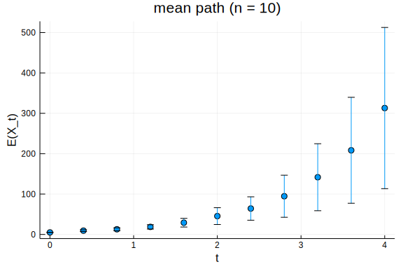

````julia
using InteractiveUtils
using NewBioSimulator
using Plots
````


````
Julia Version 1.1.0
Commit 80516ca202 (2019-01-21 21:24 UTC)
Platform Info:
  OS: macOS (x86_64-apple-darwin18.2.0)
  CPU: Intel(R) Core(TM) i7-4750HQ CPU @ 2.00GHz
  WORD_SIZE: 64
  LIBM: libopenlibm
  LLVM: libLLVM-6.0.1 (ORCJIT, haswell)
Environment:
  JULIA_EDITOR = atom  -a
  JULIA_NUM_THREADS = 4
````


## Example model

````julia
include(joinpath(@__DIR__, "test", "test-models", "kendall.jl"))

m = kendall()
m.reaction_list
````


````
OrderedCollections.OrderedDict{Symbol,NewBioSimulator.Reaction} with 3 entr
ies:
  :birth       => X -> 2 X…
  :death       => X -> ∅…
  :immigration => ∅ -> X…
````


## The SamplePath struct

Our software simulates stochastic processes $\{X_{t}\}_{t \ge 0}$ governed by Markovian dynamics.
A *sample path*, denoted $X_{t}(\omega)$, is a particular realization of the process.
This is precisely the type of data (time series) generated by `simulate`, independent of whether the state space involves population counts (well-mixed) or configurations of particles (lattice-based).
Namely, we need to keep track of each observation `u` and its time of observation `t`.
Because the observed values of well-mixed processes are vectors, our new `SamplePath` object is based on the work of RecursiveArrayTools.jl.

**NB: The ideas in that package may one day be migrated to Base. It's better than spinning up our own implementation.**

````julia

struct SamplePath{T,N,A,B} <: AbstractVectorOfArray{T, N}
  u::A
  t::B
end
````


### Basic functionality

First let's generate a single realization of the birth-death-immigration process:

````julia
# note: the parse_model business will go away one day
state, model = NewBioSimulator.parse_model(m)

# so will HasRates
xw = simulate(state, model, Direct(), 4.0, HasRates)
````


````
t: 720-element Array{Float64,1}:
 0.0                
 0.09795542124930073
 0.2104578148782978 
 0.25644314401981116
 0.2899972198012578 
 0.2916363944486594 
 0.3036610987809356 
 0.3149637815096638 
 0.31706863184651746
 0.33994673837446443
 ⋮                  
 3.993393555053409  
 3.994261989093391  
 3.995282587884014  
 3.995967114980563  
 3.9974215583045734 
 3.9974593146641313 
 3.9982391011046525 
 3.998634855215054  
 4.0                
x: 720-element Array{Array{Int64,1},1}:
 [5]  
 [4]  
 [5]  
 [6]  
 [7]  
 [8]  
 [7]  
 [8]  
 [9]  
 [10] 
 ⋮    
 [230]
 [231]
 [230]
 [229]
 [230]
 [229]
 [230]
 [231]
 [231]
````


#### Array interface

Get the value of the process at the $k$-th time step:
````julia
xw[1]
````


````
1-element Array{Int64,1}:
 5
````


Get the value of the $j$-th component at the $k$-th time step:
````julia
xw[1, end]
````


````
231
````


Support for the `Colon` and range indexing:
````julia
xw[:, 1]
````


````
1-element Array{Int64,1}:
 5
````


````julia
xw[1, 1:3]
````


````
3-element Array{Int64,1}:
 5
 4
 5
````


We can even iterate over the object:
````julia
# note you can try computing the sum using a for loop
# but it does not work unless you put the computation in a function
# it causes a weird variable scoping issue; may be a bug
sum(xw[1,i] for i in eachindex(xw))
````


````
75953
````


````julia
sum(xw)
````


````
1-element Array{Int64,1}:
 75953
````


### Plotting

The RecipesBase.jl package provides a nice interface for building visualizations:
````julia

# whenever Plots.jl sees a SamplePath object, replace it with the observation times and values
@recipe function f(xw::SamplePath)
  seriestype --> :steppre

  xw.t, xw'
end

# special case for SamplePath objects whose data is simply a number (as opposed to vector in general)...
@recipe function f(xw::SamplePath{T,1}) where {T}
  seriestype --> :steppre

  xw.t, xw.u
end
````


The `seriestype --> :steppre` syntax is to tell Plots.jl that the data should be plotted as a step function.
Those two recipes are all that are needed to make plotting work:
````julia
plot(xw,
  title  = "a sample path",
  xlabel = "t",
  ylabel = "X_t",
  legend = nothing)
````


## Generating ensembles

Usually we don't care about a single realization of a stochastic process and instead want to compute statistics from several realizations.
Internally, this is handled by the following object:

````julia

Ensemble{T,N,A,B} = Vector{SamplePath{T,N,A,B}}
````


which is an alias for a vector of `SamplePath`s.
As an example, let's generate `10` sample paths of our model:

````julia
ensemble = [simulate(state, model, Direct(), 4.0, HasRates) for i in 1:10]

ensemble[1]
````


````
t: 1598-element Array{Float64,1}:
 0.0                
 0.06307278835738662
 0.12997270902845903
 0.17751842101810641
 0.18696912776402824
 0.21040710596703685
 0.34085713277434504
 0.4531681512818961 
 0.45341630416414136
 0.48160153633923153
 ⋮                  
 3.993912797559858  
 3.994339069323033  
 3.9955428688850496 
 3.9958504125114924 
 3.9961349135808257 
 3.9977563764820285 
 3.9985590916261398 
 3.999515781583648  
 4.0                
x: 1598-element Array{Array{Int64,1},1}:
 [5]  
 [6]  
 [5]  
 [6]  
 [7]  
 [6]  
 [7]  
 [8]  
 [7]  
 [6]  
 ⋮    
 [574]
 [575]
 [574]
 [573]
 [572]
 [571]
 [570]
 [571]
 [571]
````


The `Ensemble` alias is just there to make writing code easier.
For example, we can generate a default recipe for ensembles which visualizes a mean path.
This requires us to compute the mean value of the process at a particular time $t$ over several samples indexed by $\{\omega_{1}, \ldots, \omega_{n}\}$.
For now, we have a `get_regular_path` function that builds a `SamplePath` with observations at specific time points.
This is simply a constant interpolation of the data *that necessarily discards information about the process*.

````julia

@recipe function f(ens::Ensemble, epochs = 100)
  # regularize the sample paths
  tfinal = ens[1].t[end]

  reg = get_regular_ensemble(ens, tfinal, epochs)

  # extract the series data
  ts = reg[1].t
  xs = convert(Array, mean(reg)')

  ts, xs
end
````


Here `epochs` lets us specify the number of interpolation points to use.
**NB: We need a better interface and implementation for interpolating data**.

````julia
plot(ensemble, 10,
  title  = "mean path (n = 10)",
  xlabel = "t",
  ylabel = "E(X_t)",
  legend = nothing)
````



